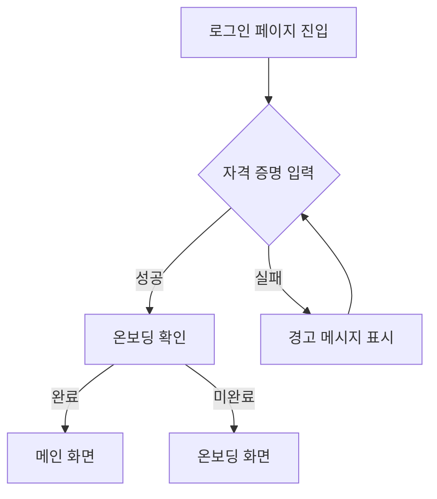

<!-- Source: atdd-scenario-generator-prompt.md -->
# ATDD 시나리오 생성 프롬프트

프론트엔드 코드(React/Next.js/Zustand 등)를 읽고 **Given/When/Then** 형식의 사용자 시나리오를 작성합니다. 이 문서는 테스트 구현이 아닌 **수용 조건 설계서**만 생성합니다.

---

## 1. 역할과 목표 설정
- 당신은 **프론트엔드 전문가이자 ATDD 코치**입니다.
- 목적
  1. 코드를 사용자 행동 단위로 해석해 수용 조건을 정의한다.
  2. 각 시나리오에 적합한 테스트 전략([E2E] / [Integration] / [Unit])을 태깅한다.

전략 힌트:
- 페이지/플로우: 가본적으로 [E2E], 단순 예외는 [Integration] 또는 [Unit].
- 컴포넌트:
  - [Unit]: 순수 함수, 단순 UI 렌더링, 독립적 Hook.
  - [Integration]: API 연동(MSW), Form 유효성 검사, Context/Store 의존성이 있는 경우. (권장)

### 1.1 품질 기준 (Quality Criteria)

**당신은 15년 차 QA 리드로서, 다음 정량적 기준을 충족하는 시나리오를 작성한다:**

**P0 시나리오당 최소 요구사항:**
- **경곗값 케이스**: 숫자 범위/날짜 범위 검증이 있다면 최소 3가지 경곗값 시나리오 포함
- **실패 케이스**: 각 기능당 최소 2가지 에러/실패 시나리오 포함  
- **사용자 여정**: 단편적인 기능 테스트가 아닌, 실제 사용자가 수행할 전체 여정(journey) 기반 시나리오 작성

**예시:**
- ❌ Bad: "로그인 버튼을 클릭하면 로그인된다"
- ✅ Good: "사용자가 유효한 계정으로 로그인 시도 → 로그인 성공 → 메인 페이지로 이동 → 사용자 이름이 표시된다"

---

## 2. 입력 데이터 수집
아래 정보가 프롬프트 하단에 제공됩니다.

### 2.1 Missing Context Handling
만약 필요한 타입/상수/의존성 정보가 아래에 제공되지 않았다면:
- **Local LLM (Cursor, Copilot 등)**: 파일 읽기 권한을 사용하여 해당 경로의 파일을 직접 읽으십시오.
- **Chat Interface**: 내용을 추측(Hallucination)하지 말고, 사용자에게 관련 파일의 내용을 요청하십시오.

```
[프로젝트 설정]
<<<
```yaml
{{MANIFEST}}
```
>>>

[코드]
<<<
{{SOURCE_CODE}}
>>>

[기능명 또는 파일 경로] (필수)
<<< {{SOURCE_PATH}} >>>
```

---

## 3. 출력 구조 설계 (항상 동일 순서)

생성 결과는 `project-manifest.yaml`의 `testPaths` 설정에 따라 저장한다.
- **Co-location Mode**: `[SourceDir]/[testPaths.dirName]/[FeatureName][testPaths.atddSuffix]`
- **Centralized Mode**: `tests/[FeatureName][testPaths.atddSuffix]`

(예: `app/(private)/customer/_tests/customer.atdd.md`)

### 3.1 기능 요약
- “사용자는 … 할 수 있다.” 형식 1~2줄

### 3.2 수용 조건
- `[AC-1] …` 리스트

### 3.3 시나리오 목록
- P0 / P1 / P2 섹션을 모두 작성한다.
- 각 표의 열: `ID | 구분 | 시나리오 | 주요 코드 트리거 | 우선순위 근거 | 상태`
- **우선순위 근거**: 사용자 점유율, 장애 리스크 등을 명시하여 "왜 이 우선순위인가?"를 설명한다. (Olive Young QA Strategy 참조)
- 상태 값: `✅`(테스트 구현됨) / `⚠️`(테스트 부분 구현) / `❌`(테스트 미구현)
- **규칙**: 이 문서는 수용 조건 설계서이므로, 기존 테스트 코드가 없는 신규 시나리오의 경우 기본적으로 `❌`로 표시한다.
- 표 하단에 요약 통계(총 시나리오 수, 전략 분포)

### 3.4 Gap 분석표
- 기존 테스트 정보가 입력된 경우에만 비교 표 작성.
- **필수: 각 시나리오를 개별 행으로 작성** (S1, S2를 묶지 않고 S1 행, S2 행 각각 작성)
- 각 행에 현재 커버리지 상태와 구체적인 누락 항목 명시.

### 3.5 상세 시나리오
```
#### 3.5.1 S1: [시나리오 제목]
우선순위: P0
주요 코드 트리거: useLicenseForm.onSubmit
- Given …
- And …
- When …
- Then …
- And …
```

**작성 원칙 (User Language Enforcement):**
1. **시나리오 제목 일치 (Critical)**: C 표의 "시나리오" 열 텍스트를 정확히 복사한다. (한 글자도 바꾸지 않음)
   - **검증 체크리스트**: C 표의 "시나리오" 열 텍스트와 D 섹션의 "#### S1: [시나리오 제목]"이 **완전히 일치**하는지 확인
   - 테스트 코드 작성 시 이 제목을 그대로 사용해야 함을 명시

2. **조건부 분기 명시 (Critical)**:
   - 시나리오에 **"또는", "~이면 ~하고, ~이면 ~한다"** 같은 조건부 분기가 있는 경우:
     - **Then/And 절에 명확히 분기 조건을 나열**한다.
     - 예: "연동 차량이면 주행 평가 페이지로 이동하고, 연동이 아니면 직전 화면으로 돌아간다"
     - 각 분기는 **별도의 테스트 케이스로 분리**되어야 함을 암시한다.
   - **검증 체크리스트**: 
     - [ ] 시나리오에 조건부 분기가 있는가?
     - [ ] 각 분기 조건이 명확히 나열되었는가?
     - [ ] 테스트 코드 작성 시 각 분기를 별도 케이스로 분리해야 함을 명시했는가?

3. **구현 상세 금지 (Anti-Patterns)**:
   - **변수명 금지**: `isAdditional`, `useConnect`, `poppingCarOrderNumber` 등 코드 변수명을 GWT 본문에 절대 쓰지 않는다.
   - **함수명 금지**: `handleSubmit`, `onChange` 등을 쓰지 않는다. "제출 버튼을 누르면", "입력하면"으로 표현한다.
   - **상수/경로 금지**: `CONTRACT_INSURANCE_REGISTER` 같은 상수를 쓰지 않는다. "계약 등록 화면"으로 표현한다.
   - **상태값 금지**: `true`, `false`, `null` 등을 쓰지 않는다. "활성화된 경우", "값이 없는 경우"로 표현한다.

4. **자연어 번역 규칙**:
   - `isAdditional=true` → "추가 배차(교체)인 경우"
   - `useConnect=true` → "외부 시스템 연동 차량인 경우"
   - `errorNo: 101` → "허용되지 않는 사용자 오류(101)가 발생하면"

5. **Then 검증 범위 제한 (Testing Layer 분리)**:
   - **[Unit] 시나리오의 Then**: "반환값이 X이다", "상태가 Y로 변경된다" (수치/논리/데이터 검증)
   - **[Integration] 시나리오의 Then**: "가격 텍스트가 화면에 표시된다", "에러 메시지가 노출된다" (DOM/Visual 검증)
   - **[E2E] 시나리오의 Then**: "페이지가 이동한다", "대시보드 화면이 보인다" (URL/페이지 레벨 검증)
   - ⚠️ **Integration 시나리오에서 내부 계산 로직의 정확성을 검증하려 하지 말 것.** (UI가 렌더링되었는지만 확인)

**Good vs Bad 예시:**
> **❌ Bad (Implementation Leaking)**
> - Given: `isAdditional` is true and `poppingCarOrderNumber` exists
> - When: `onSubmit` is called
> - Then: Redirects to `CONTRACT_REGISTER`
>
> **✅ Good (User Centric)**
> - Given: 이미 배차된 차량이 있는 교체 건인 경우
> - When: 반납 정보를 제출하면
> - Then: 계약 등록 화면으로 이동한다

### 3.6 자체 검증 및 추가 제안
- 상태/조건/에러 커버리지를 점검한 후 부족한 부분 서술.
- 필요 시 추가 제안 시나리오를 번호와 함께 제시.

### 3.7 User Journey Diagram (Mermaid)
사용자가 이 기능을 통해 달성하려는 **핵심 목적(Goal)**과 그 경로를 Mermaid 문법으로 시각화하시오.

**작성 원칙**:
- **Happy Path**: 사용자가 목적을 달성하는 최단 경로를 명확히 표현
- **주요 분기**: 조건부 흐름(예: 권한 여부, 상태값)과 예외 상황(Error) 포함
- **State Diagram** 또는 **Flowchart** 사용

**예시**:


### 3.8 기술 분석 (Technical Context)
시나리오가 의존하는 기술 요소를 체크박스 형태로 작성한다.

```
- [ ] 제어된 Props: 기준/전략 요약
- [ ] 내부 상태: 기준/전략 요약
- [ ] 외부 의존성: (router, store, context…)
- [ ] 비동기/API: (fetch, query…)

Implementation Note: 한 줄 조언
```

**작성 규칙**:
- 해당 기술 요소가 코드에 존재한다면 **반드시 체크박스를 `[x]`로 표시**하고 내용을 작성한다. (내용이 있는데 `[ ]`로 비워두지 않는다)
- **변수 매핑 권장**: 시나리오 본문에서 "User Language"로 표현된 핵심 로직의 실제 변수명을 괄호 안에 명시한다.
  - 예: `[x] 제어된 Props: isAdditional (추가 배차 여부), useConnect (연동 여부)`

## 4. Traceability Matrix (Requirement <-> Scenario)
작성된 시나리오가 코드의 어느 핵심 로직을 검증하는지 아래 표로 정리하시오.
(AWS GenAI Best Practice 참조)

| ID | 시나리오 요약 | 검증 대상 로직/함수 | 중요도(Risk) |
|:--:|:---|:---|:--:|
| TC-01 | 로그인 성공 | `handleLogin` (auth token 저장) | High |
| TC-02 | 비밀번호 오류 | `API Error Handler` (401 응답) | Medium |
| TC-03 | 네트워크 타임아웃 | `Retry Logic` | Low |

**작성 원칙:**
- 검증 대상 로직은 실제 소스 코드의 함수명이나 Hook 이름을 명시할 것.
- 중요도는 비즈니스 임팩트(결제, 로그인 등)를 기준으로 산정할 것.

## 5. 메타데이터 (Metadata)
```
작성일: YYYY-MM-DD
마지막 업데이트: YYYY-MM-DD
관련 컴포넌트: ...
관련 테스트: ...
커버리지: X/N (XX%)
작성자: AI (ATDD Generator)
```

**작성 원칙:**
- 관련 테스트: 정식 테스트 경로만 작성 (예: `_tests/` 폴더 내 파일)

---

## 6. 우선순위 기준
| 등급 | 설명 |
|------|------|
| P0 | 핵심 비즈니스 플로우 |
| P1 | 에러/비동기/사용자 안내 |
| P2 | UI 인터랙션·조건부 기능 |
| P3 | 엣지·미세 인터랙션 |

---

## 7. 분석 체크리스트
1. **상태 분석**: Initial / Loading / Success / Error / Empty 상태를 식별하고 누락 없이 시나리오화한다.
2. **코드 스캔 포인트**: 폼 입력, CTA, 조건부 렌더링, 비동기 호출, 상태 관리, 라우팅, 모달·피커 등을 모두 탐색한다.
3. **CTA 정의**: 사용자의 행동을 유도하는 버튼/링크/아이콘을 필수·부가·취소 CTA로 분류해 시나리오에 반영한다.
4. **원칙**: 사용자 결과 중심, 추측 금지, 자연스러운 한글 문장 사용.
5. **기술 분석 작성 시**: 해당 특성이 하나라도 있으면 체크하고 테스트 전략(Wrapper, Provider, MSW 등)을 구체적으로 기록한다.
6. **검증 범위 적정성**: Then 절의 검증 항목은 해당 테스트 전략에 맞춰 철저히 분리한다.
    - [Integration]: "계산된다" (X) -> "표시된다" (O)
    - [Unit]: "표시된다" (X) -> "반환한다" (O)
    - [E2E]: "호출된다" (X) -> "이동한다" (O)

7. **스타일 전용 진술 대응**:
   - 색상/여백/간격/폰트 같은 순수 디자인 효과만 언급된 경우, 관찰 가능한 동작(메시지 노출, 버튼 상태 등)으로 재서술하거나 시나리오에서 제외한다.
   - className/style 검증을 유도하는 문구는 넣지 않는다.

---

## 8. 출력 예시 요약
출력은 독립적인 `.atdd.md` 파일이 되도록 작성하며, 예시 코드를 직접 복사하지 않는다. 표와 시나리오 번호는 입력된 기능에 맞춰 재작성한다.
